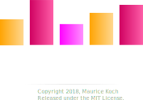

  

# Description

VisualSorting is an application that intend to visualize how different 
sort algorithms work. This idea has already been applied for instance by Timo Bingmann
with his [sound-of-sorting](https://github.com/bingmann/sound-of-sorting). Though
to get an idea how sort algorithms behave in terms of their runtime,
**visualizing them in parallel** is crucial. Therefore we introduce *Visual Sorting*.

# Features

* Visualize multiple sort algorithms **in parallel**.
* Over **ten most common sort algorithms**, including Quicksort, Mergesort and Bubblesort.
* Start/Pause feature and (manual) **single step execution**.
* Adjustment of the **running speed**.
* Free choosable **number of elements** to be sorted.

# License

Visual Sorting is licenced under the MIT License.

Copyright 2018, Maurice Koch

Permission is hereby granted, free of charge, to any person obtaining a copy of this software and associated documentation files (the "Software"), to deal in the Software without restriction, including without limitation the rights to use, copy, modify, merge, publish, distribute, sublicense, and/or sell copies of the Software, and to permit persons to whom the Software is furnished to do so, subject to the following conditions:

The above copyright notice and this permission notice shall be included in all copies or substantial portions of the Software.

THE SOFTWARE IS PROVIDED "AS IS", WITHOUT WARRANTY OF ANY KIND, EXPRESS OR IMPLIED, INCLUDING BUT NOT LIMITED TO THE WARRANTIES OF MERCHANTABILITY, FITNESS FOR A PARTICULAR PURPOSE AND NONINFRINGEMENT. IN NO EVENT SHALL THE AUTHORS OR COPYRIGHT HOLDERS BE LIABLE FOR ANY CLAIM, DAMAGES OR OTHER LIABILITY, WHETHER IN AN ACTION OF CONTRACT, TORT OR OTHERWISE, ARISING FROM, OUT OF OR IN CONNECTION WITH THE SOFTWARE OR THE USE OR OTHER DEALINGS IN THE SOFTWARE.

# Credits

Most of the program icons used in this program are based
on Google's Material Design / Monochrome icons, downloaded from www.flaticon.com.
Google's Material Design / Monochrome icons are licensed under [CC BY 3.0](https://creativecommons.org/licenses/by/3.0/).

