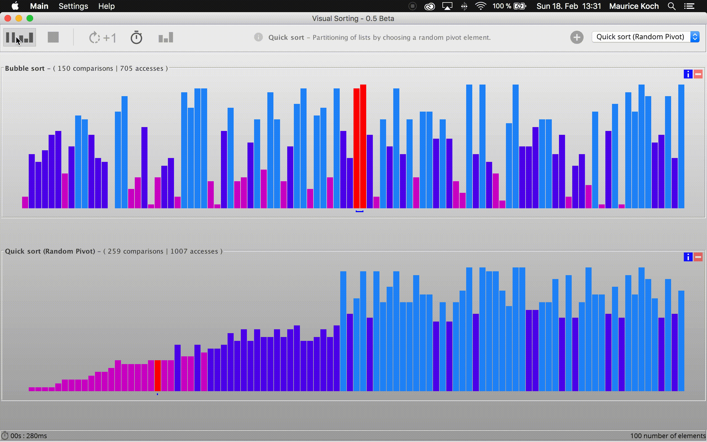

# Description

Visual Sorting is an application that visualizes the behaviour of common sort algorithms in parallel. 
The concept of VisualSorting is somewhat similar to [sound-of-sorting](https://github.com/bingmann/sound-of-sorting) developed by Timo Bingmann. 

# Features

* Multiple sort algorithms can be studied concurrently.
* Commonly known sort algorithms like Quick sort, Merge sort and Bubble sort are available.
* Start/Pause feature and (manual) single step execution.

# Maven Build

In the root directory of this repository, simply run `maven install assembly:single`. 
Make sure that Maven is installed on your machine.

# License

Visual Sorting is licenced under the MIT License.

Copyright 2018, Maurice Koch

Permission is hereby granted, free of charge, to any person obtaining a copy of this software and associated documentation files (the "Software"), to deal in the Software without restriction, including without limitation the rights to use, copy, modify, merge, publish, distribute, sublicense, and/or sell copies of the Software, and to permit persons to whom the Software is furnished to do so, subject to the following conditions:

The above copyright notice and this permission notice shall be included in all copies or substantial portions of the Software.

THE SOFTWARE IS PROVIDED "AS IS", WITHOUT WARRANTY OF ANY KIND, EXPRESS OR IMPLIED, INCLUDING BUT NOT LIMITED TO THE WARRANTIES OF MERCHANTABILITY, FITNESS FOR A PARTICULAR PURPOSE AND NONINFRINGEMENT. IN NO EVENT SHALL THE AUTHORS OR COPYRIGHT HOLDERS BE LIABLE FOR ANY CLAIM, DAMAGES OR OTHER LIABILITY, WHETHER IN AN ACTION OF CONTRACT, TORT OR OTHERWISE, ARISING FROM, OUT OF OR IN CONNECTION WITH THE SOFTWARE OR THE USE OR OTHER DEALINGS IN THE SOFTWARE.

# Icon Credits

Most of the program icons used in this program are based
on Google's Material Design / Monochrome icons, downloaded from www.flaticon.com.
Google's Material Design / Monochrome icons are licensed under [CC BY 3.0](https://creativecommons.org/licenses/by/3.0/).
