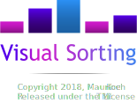

  

# Description

Visual Sorting is an application that intend to visualize how different 
sort algorithms work. This idea has already been applied for instance by Timo Bingmann
with his [sound-of-sorting](https://github.com/bingmann/sound-of-sorting). Though
to get an idea how sort algorithms behave in terms of their runtime,
**visualizing them in parallel** is crucial. Therefore we introduce *Visual Sorting*.

The (core) development of Visual Sorting is still in progress, so you may encounter misbehavior
during execution. In that case I would highly appreciate a bug report. Thanks in advance !

# Features

* Visualize multiple sort algorithms **in parallel**.
* Over **ten most common sort algorithms**, including Quick sort, Merge sort and Bubble sort.
* Start/Pause feature and (manual) **single step execution**.
* Adjustment of the **running speed**.
* Arbitrary **number of elements** to be sorted.

# Installing & Running

## Prerequisites

Make sure you have installed **Java 8.xx** installed on your machine. Then you have two options.

1. Go to `VisualSorting/out/artifacts/VisualSorting_jar/` and double-click on `VisualSorting.jar`
or if thats not working, open a terminal in the same folder and type `java -jar VisualSorting.jar`.
2. The easiest way of compiling and building the application yourself is by importing
it into IntelliJ IDEA (project files already exist).

# License

Visual Sorting is licenced under the MIT License.

Copyright 2018, Maurice Koch

Permission is hereby granted, free of charge, to any person obtaining a copy of this software and associated documentation files (the "Software"), to deal in the Software without restriction, including without limitation the rights to use, copy, modify, merge, publish, distribute, sublicense, and/or sell copies of the Software, and to permit persons to whom the Software is furnished to do so, subject to the following conditions:

The above copyright notice and this permission notice shall be included in all copies or substantial portions of the Software.

THE SOFTWARE IS PROVIDED "AS IS", WITHOUT WARRANTY OF ANY KIND, EXPRESS OR IMPLIED, INCLUDING BUT NOT LIMITED TO THE WARRANTIES OF MERCHANTABILITY, FITNESS FOR A PARTICULAR PURPOSE AND NONINFRINGEMENT. IN NO EVENT SHALL THE AUTHORS OR COPYRIGHT HOLDERS BE LIABLE FOR ANY CLAIM, DAMAGES OR OTHER LIABILITY, WHETHER IN AN ACTION OF CONTRACT, TORT OR OTHERWISE, ARISING FROM, OUT OF OR IN CONNECTION WITH THE SOFTWARE OR THE USE OR OTHER DEALINGS IN THE SOFTWARE.

# Credits

## Third-party libraries

* [IconLoader](https://github.com/bulenkov/iconloader), licensed under [Apache License 2.0](https://www.apache.org/licenses/LICENSE-2.0) - Copyright 2000-2014 JetBrains s.r.o.

## Icons

Most of the program icons used in this program are based
on Google's Material Design / Monochrome icons, downloaded from www.flaticon.com.
Google's Material Design / Monochrome icons are licensed under [CC BY 3.0](https://creativecommons.org/licenses/by/3.0/).

